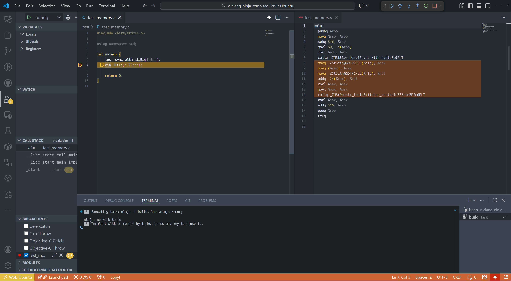

# c/c++ clang ninja template

- clang + ninja
- assembly files generation (.s)
- disassembly explorer support (extension: [dseight.disasexpl](https://marketplace.visualstudio.com/items?itemName=dseight.disasexpl))

## screenshots



## tools

Ninja + Clang

## building

```bash
./build.sh
```

or

```bash
ninja -f build.linux.ninja && ./test-memory
```

## testing

```bash
ninja -f build.linux.ninja -t clean > /dev/null 2>&1 && ninja -f build.linux.ninja && ninja -f build.linux.ninja -t clean > /dev/null 2>&1
```
